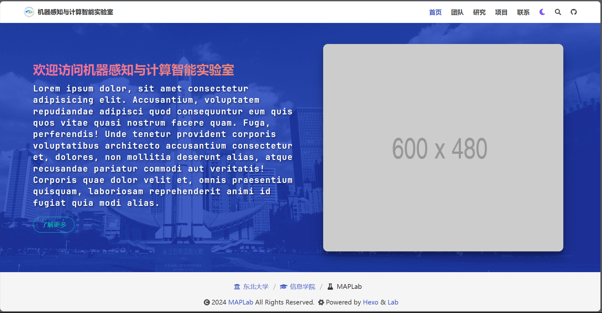

<h1 align="center">

[*hexo-theme-lab*](https://github.com/guidons-master/hexo-theme-lab)

</h1>

<p align="center">

</p>

<div align="center">

> 一个专为 **实验室网站** 而设计的 Hexo 主题

</div>

<p align="center">


</p>

## Contents 目录
- [Introduction 介绍](#introduction-介绍)
- [Demo 演示](#demo-演示)
- [Features 特点](#features-特点)
- [Installation 安装](#installation-安装)
- [Configuration 配置](#configuration-配置)
- [License 开源许可](#license-开源许可)

## Demo 演示
- [Demo Site](https://guidons-master.github.io/hexo-theme-lab/)

## Features 特点
- 扁平化风格，简洁美观  
- 夜间模式主题一键切换
- 便捷的站内搜索功能
- 精心挑选的字体，最好的阅读体验
- 响应式适配移动端/桌面端
- 支持 MathJax，支持 LaTeX 语法的数学公式

## Installation 安装

```bash
cd your-blog/themes
git clone https://github.com/guidons-master/hexo-theme-lab.git Lab
npm install
npm run server
```

## Configuration 配置

```yaml
stylesheet:
  - /css/main.css

script: 
  - /js/main.js

github: https://github.com/guidons-masters/hexo-theme-lab

menu: 
  - title: Home
    url: /
  - title: Team
    url: /team
  - title: Research
    url: /research
  - title: Projects
    url: /projects
  - title: Contact
    url: /contact

# 每页文章数
per_page_posts: 5

# MathJax功能支持, 如果不需要可以注释掉
mathjax:
  src: https://cdn.mathjax.org/mathjax/latest/MathJax.js?config=TeX-AMS-MML_HTMLorMML

lab:
  # 实验室名称
  name: 机器感知与计算智能实验室
  # 主页背景图片
  background: /assets/img/background.jpg
  # 实验室的logo
  logo: /assets/img/logo.jpg
  # 欢迎语
  welcome: 欢迎访问机器感知与计算智能实验室
  # 团队照片
  image: https://bulma.io/assets/images/placeholders/600x480.png
  # 实验室简介
  introduce: Lorem ipsum dolor, sit amet consectetur adipisicing elit. Accusantium, voluptatem repudiandae adipisci quod consequuntur eum quis quos vitae quasi nostrum facere quam. Fuga, perferendis! Unde tenetur provident corporis voluptatibus architecto accusantium consectetur et, dolores, non mollitia deserunt alias, atque recusandae pariatur commodi aut veritatis! Corporis quae dolor velit et, omnis praesentium quisquam, laboriosam reprehenderit animi id fugiat quia modi alias.
  # 实验室Github地址
  github: https://github.com/MAPLab
  # 友链
  links:
    - name: 东北大学
      url: https://www.neu.edu.cn/

    - name: 信息学院 
      url: https://ise.neu.edu.cn/

  # 实验室地址
  location:
    address: 和平区文化路3号巷
    city: 沈阳
    province: 辽宁
    country: 中国
    zip: 110169
    map: https://www.openstreetmap.org/export/embed.html?bbox=123.4326%2C41.8053%2C123.4373%2C41.8083&layer=mapnik

  # 实验室招生信息
  recruitment:
    - "1. 具有较强的计算机编程能力，具有较强的自学能力。"
    - "2. 具备较好的英文阅读和写作能力。"
    - "3. 责任心强、有团队精神，能吃苦耐劳，积极进取。"
    - "欢迎控制科学与工程、模式识别与智能系统、人工智能、控制工程、电子信息专业学生报考东北大学机器感知与计算智能实验室博士、硕士研究生！"

  # 联系方式
  contact:
    - name: John Doe
      email: johndoe@example.com
      img: https://bulma.io/assets/images/placeholders/96x96.png
    
    - name: Jane Smith
      email: janesmith@example.com
      img: https://bulma.io/assets/images/placeholders/96x96.png
    
    - name: Robert Johnson
      email: robertjohnson@example.com
      img: https://bulma.io/assets/images/placeholders/96x96.png

```

### Source 目录结构
参考 [source](./source/) 目录
```bash
source
├── _posts
│   └── test.md
├── assets
│   ├── img
│   │   └── logo.jpg
│   └── js
│       ├── OrbitControls.min.js
│       ├── luma-web.module.min.js
│       └── three.min.js
├── contact
│   └── index.md
├── projects
│   ├── a.md
│   ├── b.md
│   └── index.md
├── research
│   ├── a.md
│   └── index.md
└── team
    ├── index.md
    ├── master
    │   └── a.md
    └── professor
        ├── a.md
        └── b.md
```

### 开启 MathJax 支持（数学公式）
```yaml
---
title: MathJax Test
date: 2019-07-05 21:27:59
tags:
mathjax: true # 加入这个声明，这篇文章就会开启mathjax渲染
---
```

## License 开源许可
[MIT](https://opensource.org/licenses/MIT) © guidons
  